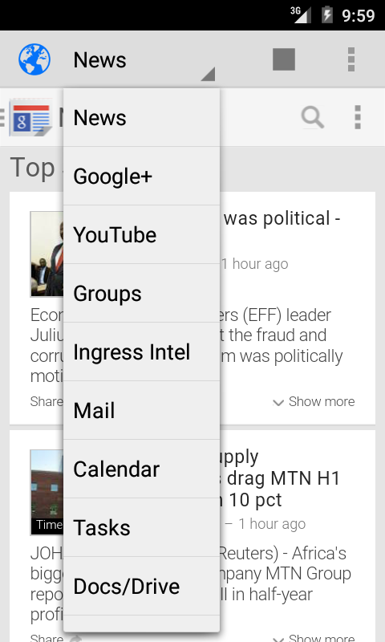

GApps Sandboxed Browser
=======================

This app started out as a way to view Google News on an Android phone or tablet, 
but now encompasses Google+, Google News, GMail, Google Maps, Google Groups, and 
other Google services. The idea is to be able to access the Google web apps without 
having to log into Google on your browser, so that you can browse privately. 

If you have an Android device with and AOSP-based ROM (like CyanogenMod), and you don't have 
GApps installed, this app is a good way to access the Google webapps privately.

Links to external sites (such as news articles, etc.) will be opened in your default 
browser, thus keeping the Google authentication sandboxed in the app. Also, the Google 
web apps are very powerful and less bandwidth-intensive than the respective apps.

See here for more:
https://plus.google.com/u/0/118226948467140990198/posts/YVNFmADvAs4

Play Store link:
https://play.google.com/store/apps/details?id=com.tobykurien.google_news

A non-Google specific version of this app called [WebApps Sandboxed Browser][webapps] is also available.

 [webapps]: https://github.com/tobykurien/WebApps
